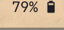
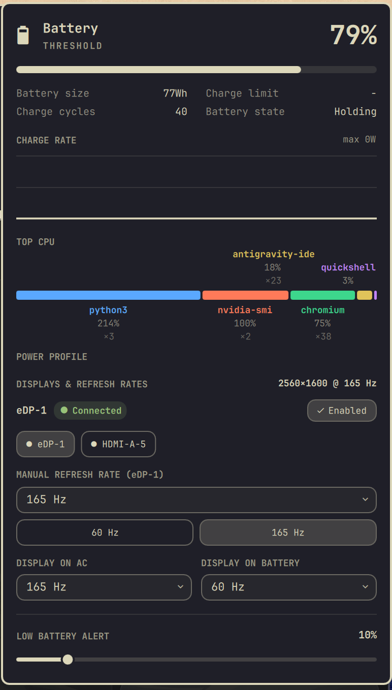

# Omarchy Power & Display Profiles

An all-in-one **Power, Battery Health & Multi-Monitor Display Refresh Rate Management** plugin and bar widget for the [Omarchy](https://omarchy.org/) shell.

Combines the visual polish, watt graphing, CPU profiling, and power profiles of [austraz.power](https://github.com/austrasien/omarchy-power.git) with the multi-monitor, resolution-preserving refresh rate automation of [battery-display-profiles](https://github.com/Hazem-Ahmed-Salem/battery-display-profiles.git):
- **austraz.power**: https://github.com/austrasien/omarchy-power.git
- **battery-display-profiles**: https://github.com/Hazem-Ahmed-Salem/battery-display-profiles.git

```
Bar icon  →  Panel flyout  →  Hero stats · 15-min Watt Graph · Top CPU · Power Profiles · Displays & Refresh Rates · Power Saver Opts · Low-Battery Alert
Service   →  Supervisor    →  PowerProfileService · DisplayRefreshService · BatteryAlertService
```

---

## 📋 Requirements & Dependencies

The plugin runs seamlessly on Omarchy with standard system utilities:
- **Hyprland** (`hyprctl` for monitor detection and refresh rate switching)
- **UPower & system D-Bus** (standard battery metrics, health, and status tracking)
- **Power Profiles daemon** (`powerprofilesctl`, `system76-power`, or `tuned` via D-Bus)
- **libnotify** (`notify-send` for low-battery alert popups)
- **Quickshell / Qt 6 QML** (provided by Omarchy)

---

## 📥 Installation Guide

### Method 1: Using `omarchy plugin` (Recommended)

1. **Add and enable the plugin**:
   ```bash
   # From local source (from within the repository folder):
   omarchy plugin add "$PWD" --enable
   # Or using absolute path:
   omarchy plugin add "/path/to/omarchy-power-display" --enable

   # Or from Git:
   omarchy plugin add https://github.com/Hazem-Ahmed-Salem/omarchy-power-display.git --enable
   ```

2. **Disable conflicting stock or standalone plugins** (prevents duplicate bar chips and conflicting background services):
   ```bash
   omarchy plugin disable omarchy.power
   omarchy plugin disable omarchy.battery
   omarchy plugin disable battery-display-profiles 2>/dev/null || true
   omarchy plugin disable austraz.power 2>/dev/null || true
   ```

3. **Restart the shell**:
   ```bash
   omarchy restart shell
   ```

---

### Method 2: Manual Installation

1. **Link or copy the plugin into your Omarchy plugins directory**:
   ```bash
   ln -sfn "$PWD" ~/.config/omarchy/plugins/hazem.power
   # Or using absolute path:
   # ln -sfn "/path/to/omarchy-power-display" ~/.config/omarchy/plugins/hazem.power
   ```
   *(Or clone directly via Git)*:
   ```bash
   git clone https://github.com/Hazem-Ahmed-Salem/omarchy-power-display.git ~/.config/omarchy/plugins/hazem.power
   ```

2. **Configure your bar layout in `~/.config/omarchy/shell.json`**:
   Add `{"id": "hazem.power"}` under `bar.layout.right`:
   ```json
   {
     "bar": {
       "layout": {
         "right": [
           {
             "id": "hazem.power",
             "showPercentage": true
           }
         ]
       }
     },
     "disabledPlugins": [
       "omarchy.power"
     ]
   }
   ```
   *(Or using the Omarchy CLI)*:
   ```bash
   omarchy bar put hazem.power --section right
   omarchy plugin disable omarchy.power
   ```

3. **Restart the shell**:
   ```bash
   omarchy restart shell
   ```

---

## 🗑️ Uninstallation Guide

### Method 1: Using `omarchy plugin`

1. **Remove the plugin**:
   ```bash
   omarchy plugin remove hazem.power --yes
   ```

2. **Re-enable the stock power plugin (optional)**:
   ```bash
   omarchy plugin enable omarchy.power
   ```

3. **Restart the shell**:
   ```bash
   omarchy restart shell
   ```

---

### Method 2: Manual Uninstallation

1. **Remove the plugin folder/symlink**:
   ```bash
   rm -rf ~/.config/omarchy/plugins/hazem.power
   ```

2. **Restore stock plugin and remove entry from `~/.config/omarchy/shell.json`**:
   ```bash
   omarchy plugin enable omarchy.power
   ```
   *(Or remove `{"id": "hazem.power", ...}` directly from `bar.layout.right` in `~/.config/omarchy/shell.json`)*.

3. **Clean up runtime state files (optional)**:
   ```bash
   rm -f ~/.local/state/omarchy/power/watt-history.json
   rm -f ~/.local/state/omarchy/battery/low-battery-alert
   rm -rf ~/.local/state/omarchy/powerprofiles
   ```

4. **Restart the shell**:
   ```bash
   omarchy restart shell
   ```

---

## 📸 Preview

### Status Bar Widget
Compact status bar chip with real-time battery percentage, dynamic charging states, right-click toggle, and low-battery alert warning:

<p align="center">
  
</p>

### Interactive Control Panel Flyout
Clicking the bar widget opens the complete power and display control center:

<p align="center">
  
</p>

---

## 🚀 Key Features

### 🔋 Battery Hero & Live Stats
- Animated battery icon with charge-flow indicators and rotating status phrases.
- Battery capacity, cycle count, and calculated health percentage from sysfs.
- Remaining battery duration with wall-clock ETA (e.g. `1h 20m · 19:45`).
- Right-click the status bar icon to toggle the numerical percentage chip on/off.

### 📈 15-Minute Watt History Chart
- Background sampling every 10s (every 5s while the panel is open).
- Canvas chart with automatic axis scaling (`niceCeil`), smooth fill, and decluttered peak callouts.
- Persisted to disk (`~/.local/state/omarchy/power/watt-history.json`) across shell restarts.

### 🖥 Top CPU Usage Stacked Bar
- Samples running processes via `ps` only when the panel is open (every 2.5s).
- Aggregates multi-process applications into a single item with PID count (e.g., `code ×8`).
- Uses two-lane collision-free text placement with measured `TextMetrics` widths.

### ⚡ Power Profile Preferences
- Quick toggle between `Power Saver`, `Balanced`, and `Performance` profiles.
- Independent **ON AC** and **ON BATTERY** preferences stored in `~/.local/state/omarchy/powerprofiles/`.
- Changing the profile for the opposite power state saves for later without disrupting the active session.

### 🖥 Displays & Refresh Rates Automation
- **Multi-Monitor Auto-Detection**: Discovers all connected displays dynamically (`eDP`, `HDMI`, `DP`, USB-C) at startup and on hotplug.
- **Strict Resolution Preservation**: Never alters screen resolution or resets window positions, scaling, or workspaces. Only refresh rates switch.
- **Manual Refresh Rate Overrides**: One-click buttons to instantly switch between supported refresh rates for the active display resolution.
- **AC vs. Battery Display Profiles**: Configure preferred refresh rates for AC (e.g. 144Hz/120Hz) and Battery (e.g. 60Hz) per monitor.
- **Safe Hyprland Integration**: Uses Hyprland's Lua runtime evaluation (`hyprctl eval 'hl.monitor(...)'`) with numeric tolerance (~0.1 Hz) and post-switch verification.

### 🍃 Power Saver Desktop Options
When `power-saver` profile is active, dedicated energy-saving controls become available:
- **Display Refresh Rate**: Applies the monitor's battery power-saving refresh rate.
- **Backlight Brightness**: Integrated slider (syncs with hardware OSD keys).
- **Wi-Fi Power Save**: Toggles NetworkManager 802.11 power saving mode.
- **Hyprland Animations**: Disables compositor animations to save GPU/CPU cycles.
- **GPU DPM & AMD Panel Power**: Direct toggles for kernel/firmware display power reduction.

### 🔔 Low-Battery Alert Service
- Interactive slider from 5% to 40% in the flyout panel.
- Bundled headless alert service triggers `omarchy-battery-low <level>`.
- The status bar icon flashes in the theme accent color while under the threshold on battery.

---


## 🏛 Architecture

The plugin is structured into modular layers:

```
omarchy-power-display/
├── manifest.json              # Plugin registration, entry points, and schema
├── Service.qml                # Root service supervisor
├── PowerProfileService.qml    # AC/Battery power profile switching
├── DisplayRefreshService.qml  # Multi-monitor refresh rate automation & hotplug
├── DisplayController.qml      # Safe Hyprland Lua monitor interface
├── BatteryAlertService.qml    # Low-battery threshold notification service
├── Panel.qml                  # Flyout panel UI & status bar widget
├── PowerChart.qml             # 15-minute watt history canvas chart
├── Model.js                   # Chart math, CPU collision layout, formatting
├── BatteryModel.js            # Battery warning & threshold utilities
├── bin/
│   ├── power-refresh          # Fast battery & profile sysfs collector
│   └── power-saver-opts       # Brightness, Wi-Fi PS, animations, and DPM helper
└── tests/
    ├── test_model_logic.js    # Unit tests for Model.js & BatteryModel.js
    ├── test_mode_logic.js     # Unit tests for display mode parsing & tolerance
    └── validate.sh            # Complete automated validation script
```

---

## ⚙️ Configuration & IPC

Settings are saved in `~/.config/omarchy/shell.json`:

```json
{
  "id": "hazem.power",
  "showPercentage": true,
  "lowBatteryAlert": 10,
  "monitors": [
    {
      "name": "eDP-1",
      "enabled": true,
      "acMode": "1920x1080@144",
      "batteryMode": "1920x1080@60"
    }
  ]
}
```

### IPC Commands
```bash
omarchy-shell hazem.power open
omarchy-shell hazem.power close
omarchy-shell hazem.power toggle
omarchy-shell hazem.power togglePercentage
```

---

## 🧪 Validation & Testing

Run the test suite to verify file structure, JSON validity, and logic:
```bash
./tests/validate.sh
```

---

## ⚖️ License

Licensed under the **MIT License**.
Based on components by [austraz](https://github.com/austrasien/omarchy-power.git), [Hazem-Ahmed-Salem](https://github.com/Hazem-Ahmed-Salem/battery-display-profiles.git), and the Omarchy authors.
